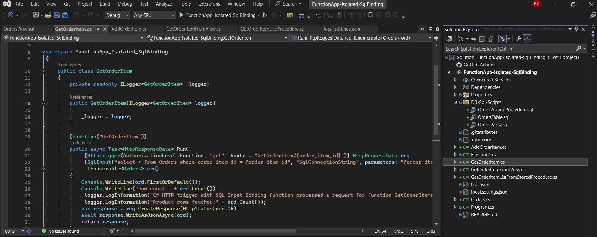
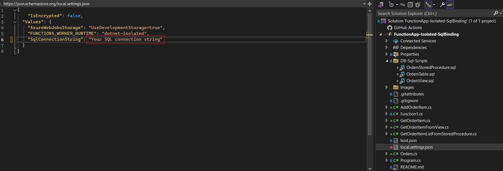
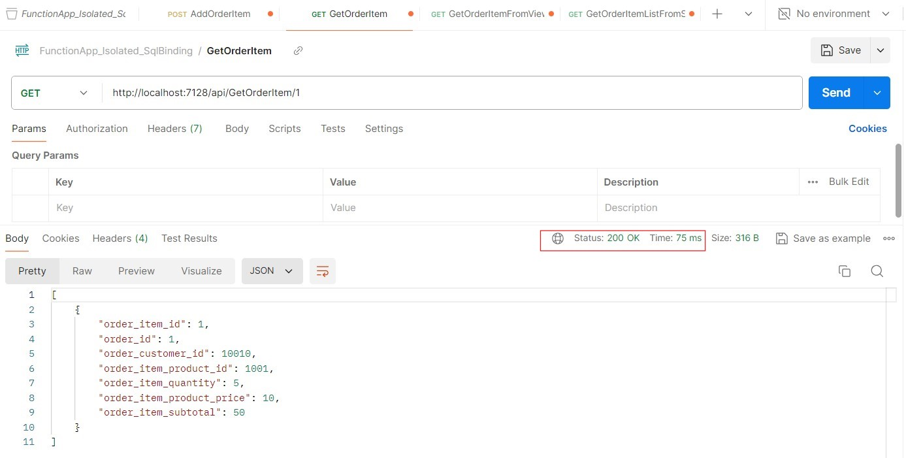
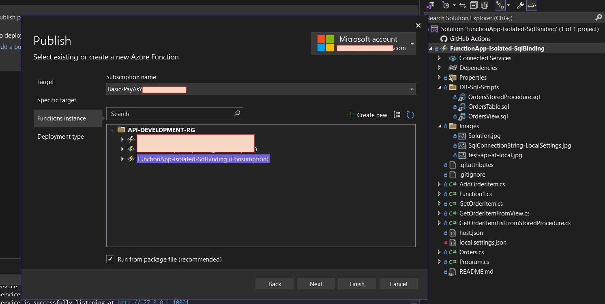
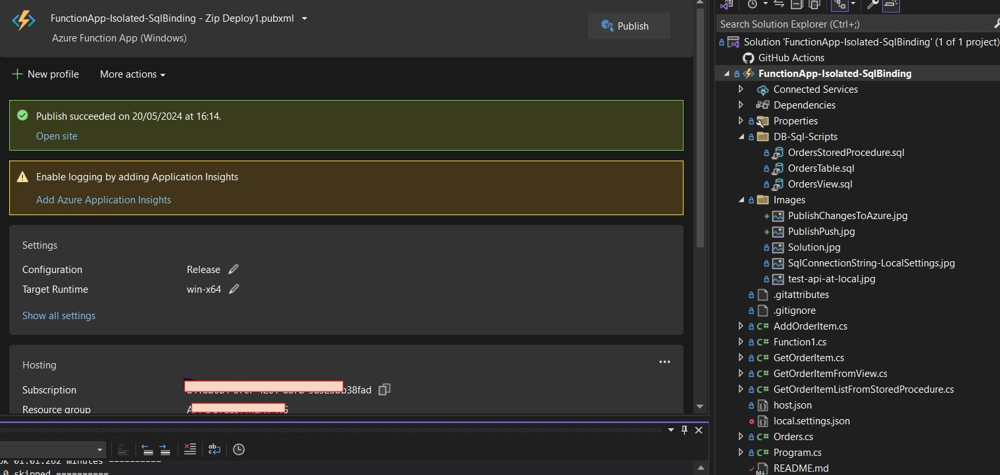
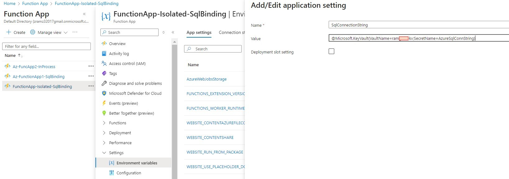
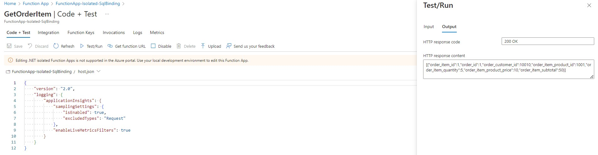
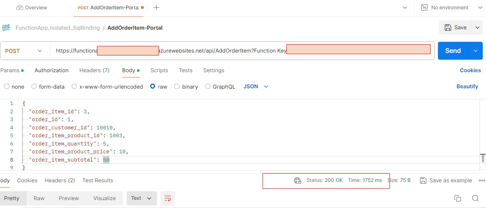
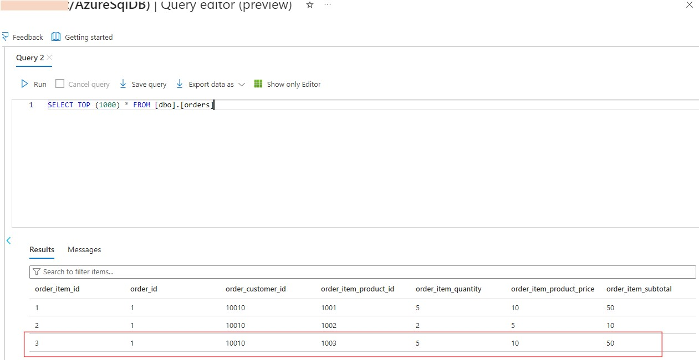

# Creating a REST API using Azure Functions (Isolated Process)

This project demonstrates how to create a REST API to perform CRUD operations using Azure Functions and SQL Database.

## Business Objective

This project is for learning purposes. It helps you get started with creating REST APIs using Azure serverless integration services.

## Prerequisites

- Visual Studio Community Edition
- Azure account with access to Azure Functions, Key Vault, Azure SQL, and APIM

## Setup

1. Create a new solution (Azure Function App) in Visual Studio.
2. Create the database objects (Tables, Views, and Stored Procedures) mentioned in the DB-Sql-Scripts.

## Solution

Add required functions (e.g., GetOrderItem, AddOrderItem, etc.) to the solution and write your backend logic for each.

## Connection

- To test locally, define the SQL connection URL in the `local.settings.json` file.
- To test on Azure, set this connection in Environment variables > App settings.

## Test APIs Locally

Test the APIs locally before publishing them to the cloud.

## Configuration Required for Deployment and Access

1. Create a Function App from the Azure portal and allow basic authentication so that Visual Studio can deploy to your Function App in the Azure cloud.
2. Enable system-assigned managed identity for the created Function App.
3. Create a secret in Azure Key Vault for the Azure SQL connection URL.
   - Assign the Contributor role to the Function App.
   - Assign Get and List secret access policies to the Function App.

## Security Aspects

- Protect your functions with function keys.
- Allow only selected VNET and IP addresses. This can be configured in Function App > Settings > Networking.

## Publish to Azure Cloud

Once tested locally, the code can be pushed to the cloud.
1. Select your Azure account, subscription, and Function App to create a publish profile.
2. Push the code after creating the publish profile.

## SQL Connection Setting

Define the SQL connection string in App settings (Get connection URL from Key Vault).

## Test APIs at the Portal

- Test `GetOrderItem`

- Test `AddOrderItem`

- Order Added to SQL DB

## Conclusion and Limitations

This project covers basic details. You can add validation and business logic as needed. For better security and scalability, you can create APIM endpoints pointing to Azure Functions. For simplicity, this example uses Azure SQL, but you can use any other SQL Database.